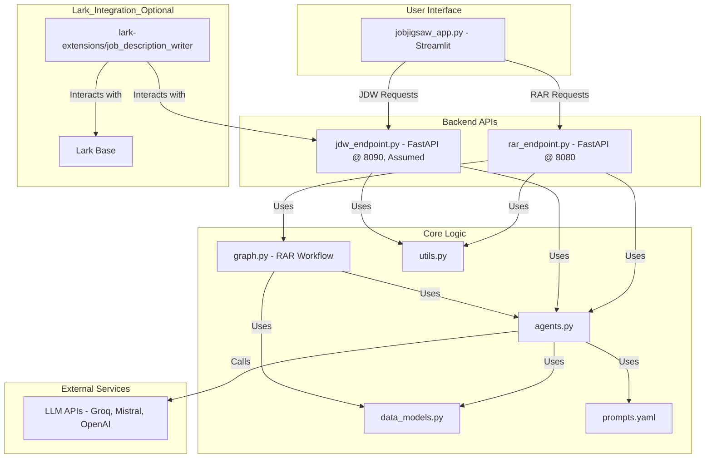

### **IMPORTANT NOTICE !!**
DON'T MIND THE `lark-extensions/` DIRECTORY. PLEASE REFER TO 
[JOBJIGSAW-LARK](https://github.com/rhyliieee/JobJigSaw-Lark) 
TO VIEW FULL IMPLEMENTATION AND SETUP OF LARK-INTEGRATION


# JobJigSaw: AI Resume Analyzer and Job Description Writer

An intelligent application suite that analyzes resumes, provides detailed feedback using advanced language models, writes formal job descriptions, and includes functionality for cross-job comparisons.

## Features

- **Resume Analysis & Reranking (RAR):** Analyzes resumes against job descriptions, providing scores, strengths, and areas for improvement.
- **[Job Description Writer (JDW)](https://github.com/rhyliieee/JDW):** Generates formal job descriptions from basic input text files.
- **Cross-Job Comparison:** Matches resumes with the most suitable job descriptions across multiple openings.
- **[Lark Base Integration](https://github.com/rhyliieee/JobJigSaw-Lark):** Includes a Lark extension for processing job descriptions directly within Lark Base (see `lark-extensions/job_description_writer/README.md`).
- **Multi-LLM Support:** Compatible with models from Groq, Mistral AI, and OpenAI.
- **Asynchronous Processing:** Utilizes FastAPI background tasks for non-blocking API operations.
- **Caching System:** Improves performance for repeated operations.
- **Structured Output:** Uses Pydantic models for reliable data handling.
- **Web Interface:** Streamlit application (`jobjigsaw_app.py`) provides a user-friendly interface for both JDW and RAR functionalities.

## Prerequisites

- Python 3.8 or higher
- Required API keys (depending on the models used):
  - Groq API key
  - Mistral AI API key
  - OpenAI API key
  - Direc RAR API key (`DIREC_RAR_API_KEY`)
  - Direc JDW API key (`JDW_AGENT_API_KEY`)

## Installation

1.  Clone the repository:
    ```bash
    git clone https://github.com/rhyliieee/JobJigSaw.git
    ```
    <!--  -->
2.  Change directory into the project directory:
    ```bash
    cd JobJigSaw
    ```
    <!--  -->
3.  Create a Virtual Environment:
    ```bash
    python -m venv venv
    ```
    <!--  -->
4.  Activate Virtual Environment:
    ```bash
    # Windows
    venv\Scripts\activate
    # macOS/Linux
    # source venv/bin/activate
    ```
    <!--  -->
5.  Install dependencies:
    ```bash
    pip install -r requirements.txt
    ```
    <!--  -->
6.  Create a `.env` file in the `JobJigSaw` directory with your API keys:
    ```env
    GROQ_API_KEY=your_groq_api_key_here
    MISTRAL_API_KEY=your_mistral_api_key_here
    OPENAI_API_KEY=your_openai_api_key_here
    DIREC_RAR_API_KEY=your_rar_api_key_here
    JDW_AGENT_API_KEY=your_jdw_api_key_here

    # Optional: Specify API URLs if not running locally
    # RAR_API_URL=http://your_rar_api_host:8080
    # JDW_API_URL=http://your_jdw_api_host:8090
    ```
    <!--  -->

## Available Models

### Groq Models
- llama-3.3-70b-versatile
- llama-3.1-8b-instant
- qwen-qwq-32b
- qwen-2.5-32b

### Mistral AI Models
- mistral-large-latest
- ministral-8b-latest

### OpenAI Models
- o4-mini-2025-04-16
- gpt-4o-2024-11-20
- gpt-4o-mini-2024-07-18

## Usage

1.  **Start the API Servers:**
    Open two separate terminals, activate the virtual environment in each, and run the following commands:

    *   **Terminal 1 (RAR API):**
        ```bash
        uvicorn rar_endpoint:app --reload --host 0.0.0.0 --port 8080
        ```
        <!--  -->
        The RAR API endpoint will be available at `http://localhost:8080`.

    *   **Terminal 2 (JDW API):**
        *(Note: Follow this [link](https://github.com/rhyliieee/JDW) to setup JDW)*
        ```bash
        # Make sure jdw_endpoint.py exists and defines a FastAPI app named 'app'
        uvicorn jdw_endpoint:app --reload --host 0.0.0.0 --port 8090
        ```
        The JDW API endpoint will be available at `http://localhost:8090`.

2.  **Start the Streamlit UI Application:**
    Open a third terminal, activate the virtual environment, and run:
    ```bash
    streamlit run jobjigsaw_app.py
    ```
    <!--  -->
    The Streamlit application will be available at `http://localhost:8501` (or the URL provided in the terminal).

3.  **Verify API Connections:**
    Visit the running Streamlit UI and check the sidebar. Ensure both API statuses show `API Connected`.
    <!--  -->

## API Endpoints

API documentation is available via Swagger UI and ReDoc when the servers are running:
- RAR API Docs: `http://localhost:8080/docs` or `/redoc`
- JDW API Docs: `http://localhost:8090/docs` or `/redoc`

## Project Structure

```
JobJigSaw/
    ├── agents.py             # LLM agent initialization (RAR & JDW)
    ├── data_models.py        # Pydantic models for structured data
    ├── graph.py              # LangGraph Application Workflow (RAR)
    ├── jdw_endpoint.py       # FastAPI endpoint definitions for JDW (Assumed)
    ├── jobjigsaw_app.py      # Integrated Streamlit UI Application
    ├── prompts.yaml          # System prompts for LLM agents (RAR & JDW)
    ├── rar_endpoint.py       # FastAPI endpoint definitions for RAR
    ├── requirements.txt      # Python dependencies
    ├── utils.py              # Utility functions (caching, file processing)
    ├── .env                  # Environment variables (API keys, URLs)
    ├── assets/               # Images for README
    ├── docs/                 # Documentation files
```

## System Architecture



## Data Flow

1.  User interacts with `jobjigsaw_app.py` (Streamlit UI).
2.  **For Job Description Writing:**
    *   UI sends job requirements to `jdw_endpoint.py`.
    *   JDW endpoint uses `agents.py` (with JDW prompts from `prompts.yaml`) and `utils.py` to process input.
    *   LLM API is called via `agents.py`.
    *   Generated job descriptions are returned to the UI.
3.  **For Resume Analysis:**
    *   UI sends job descriptions (original or written) and resumes to `rar_endpoint.py`.
    *   RAR endpoint initiates the LangGraph workflow defined in `graph.py`.
    *   `graph.py` uses `agents.py` (with RAR/CJC prompts), `data_models.py`, and `utils.py`.
    *   LLM APIs are called via `agents.py`.
    *   Analysis results are structured using `data_models.py` and returned to the UI via status checks or direct response.
4.  Results are displayed in the Streamlit UI.

## Error Handling

The application includes robust error handling with:
- Automatic retries for API calls
- Cached responses for improved performance
- Structured error messages

## Contributing

Feel free to submit issues and enhancement requests.

## License

This project is licensed under the MIT License - see the LICENSE file for details.
