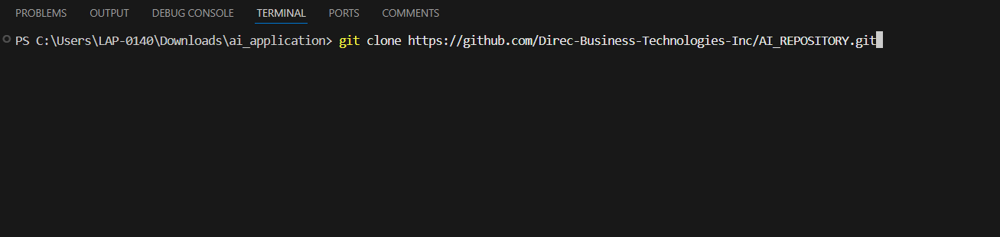
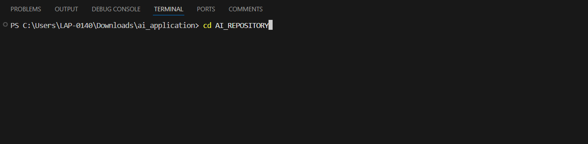
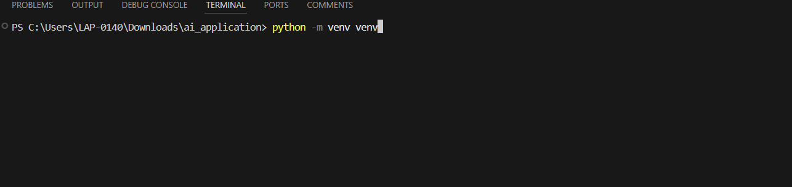
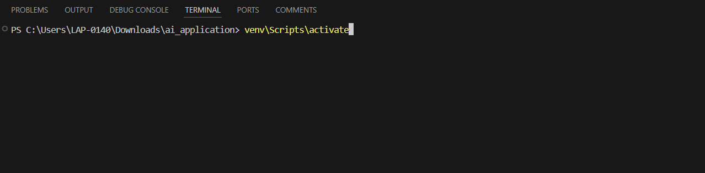
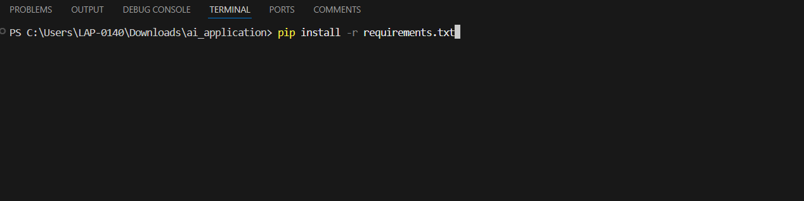
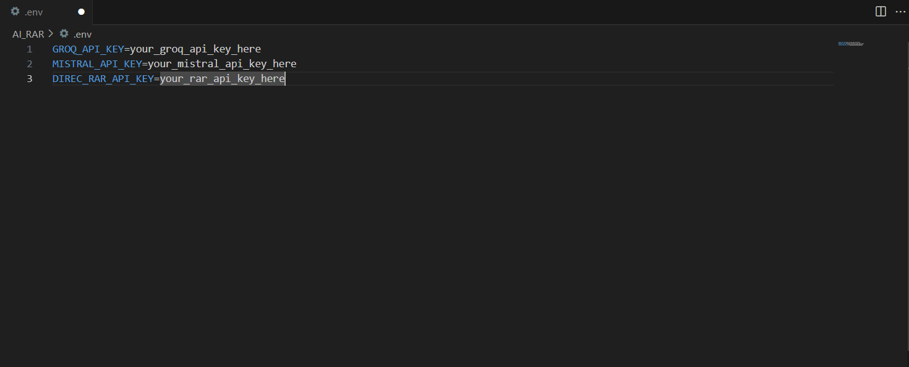
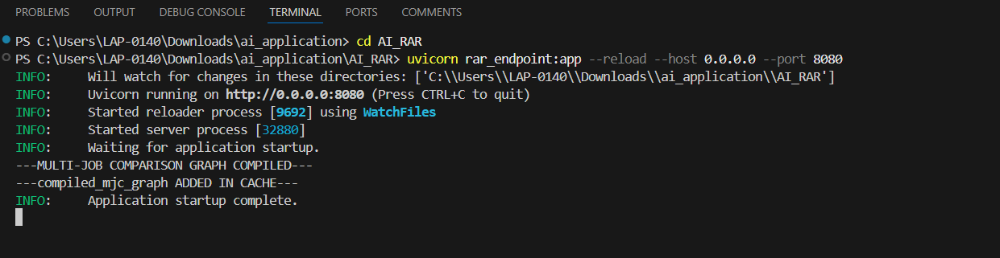
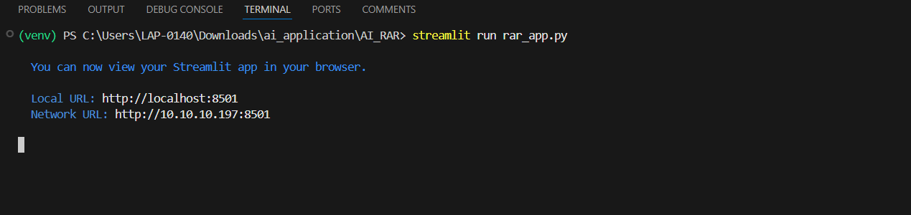
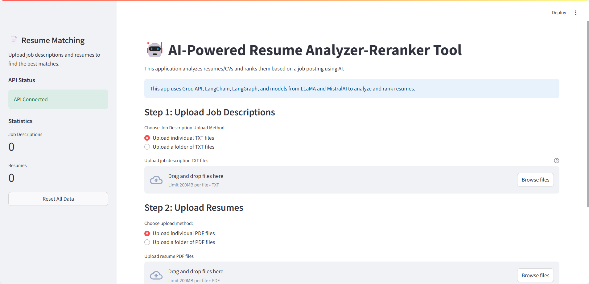
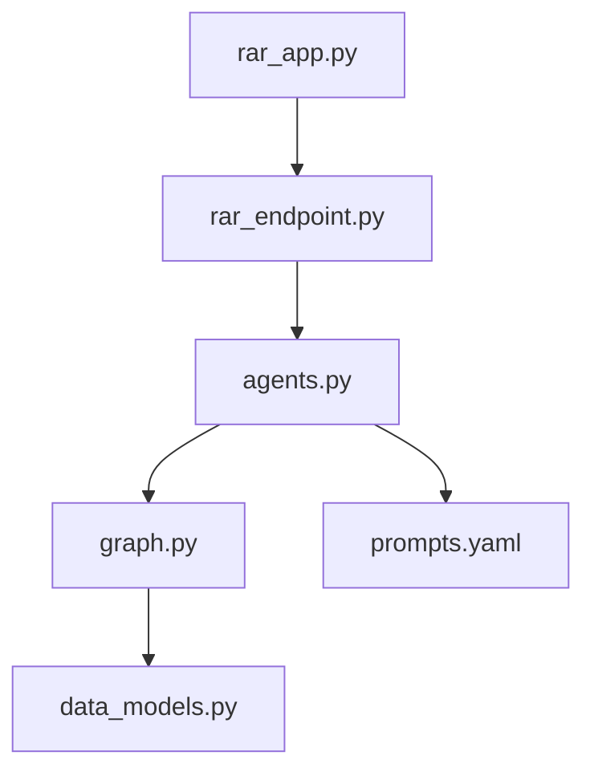

# AI Resume Analyzer and Reranker (AI-RAR)

An intelligent application that analyzes resumes and provides detailed feedback using advanced language models. The system also includes functionality for cross-job comparisons to match resumes with job descriptions.

## Features

- Resume analysis and detailed feedback generation
- Cross-job comparison and matching
- Support for multiple LLM providers (Groq, Mistral AI)
- Caching system for improved performance
- Structured output using predefined data models

## Prerequisites

- Python 3.8 or higher
- Required API keys:
  - Groq API key
  - Mistral AI API key

## Installation

1. Clone the repository
```bash
git clone https://github.com/Direc-Business-Technologies-Inc/AI_REPOSITORY.git
```

2. Change directory into project directory
```bash
cd AI_REPOSITORY
```

3. Create a Virtual Environment in terminal:
```bash
python -m venv venv
```

4. Activate Virtual Environment in terminal
```bash
venv\Scripts\activate
```

5. Install dependencies:
```bash
pip install -r requirements.txt
```

6. Create a `.env` file with your API keys:
```env
GROQ_API_KEY=your_groq_api_key_here
MISTRAL_API_KEY=your_mistral_api_key_here
DIREC_RAR_API_KEY=your_rar_api_key_here
```


## Available Models

### Groq Models
- llama-3.3-70b-versatile
- llama-3.1-8b-instant
- qwen-qwq-32b
- qwen-2.5-32b

### Mistral AI Models
- mistral-large-latest
- ministral-8b-latest

## Usage

1. Using the terminal, start the FastAPI server:
```bash
uvicorn rar_endpoint:app --reload --host 0.0.0.0 --port 8080
```


The api endpoint will be available at `http://localhost:8080`

## API Endpoints

Documentation for the API endpoints is available at:
- Swagger UI: `http://localhost:8080/docs`
- ReDoc: `http://localhost:8080/redoc`

2. Start the Streamlit UI Application
```bash
cd AI_REPOSITORY
streamlit run rar_app.py
```


The streamlit application will be available at `Local URL: http://localhost:8501`

3. Visit the running streamlit UI, and ensure API Status is `API Connected`


## Project Structure

```
AI_RAR/
    ├── agents.py         # LLM agent initialization and configuration
    ├── data_models.py    # Pydantic models for structured output
    ├── graph.py          # Langgraph Application Workflow
    ├── rar_endpoint.py   # FastAPI endpoint definitions
    ├── prompts.yaml      # System prompts for LLM agents
    ├── rar_app.py        # Streamlit Application to Interact with the API
    └── utils.py          # Utility functions and cache management     
```

## System Architecture



## Data Flow
1. User interacts with rar_app.py interface
2. Requests processed by rar_endpoint.py
3. Agents initialized from agents.py
4. Analysis workflow executed through graph.py
5. Results structured using data_models.py
6. Responses formatted and displayed in rar_app.py

## Error Handling

The application includes robust error handling with:
- Automatic retries for API calls
- Cached responses for improved performance
- Structured error messages

## Contributing

Feel free to submit issues and enhancement requests.

## License

This project is licensed under the MIT License - see the LICENSE file for details.
