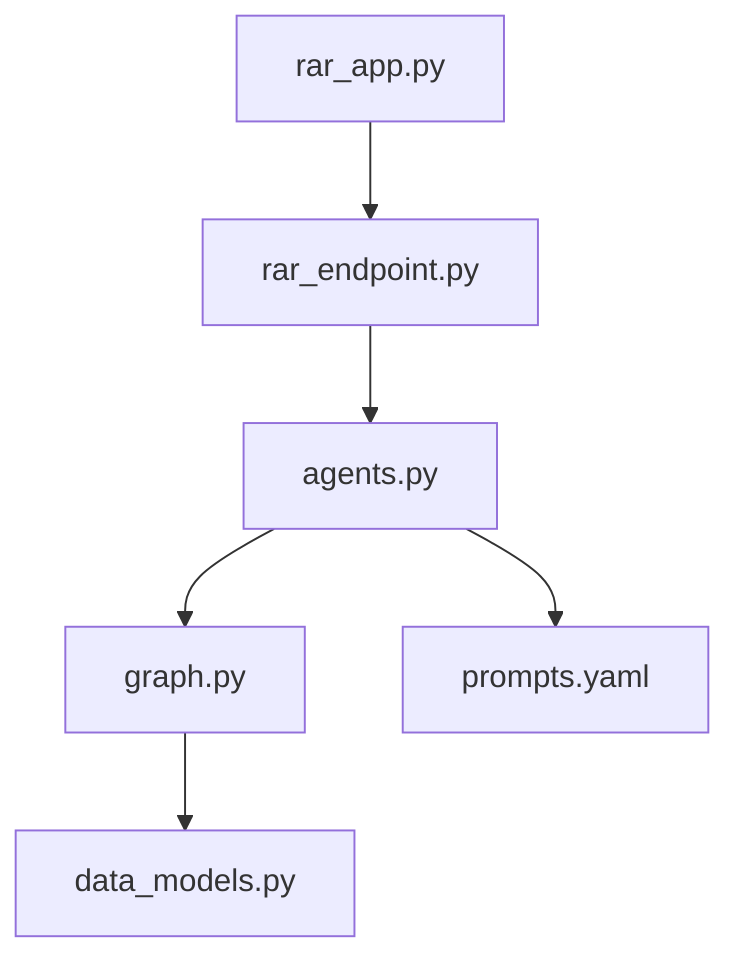

# AI-Powered Resume Analyzer-Reranker (AI_RAR) Technical Documentation

## Project Overview
The AI-Powered Resume Analyzer-Reranker is a system that uses advanced language models to analyze resumes against job descriptions and provide detailed rankings and comparisons. The system leverages LangChain and LangGraph for intelligent document processing and analysis.

## Core Components

### 1. agents.py
Core implementation of the AI agents used for analysis.

Functions:
- `initialize_llm(model_name)`: Creates and caches LLM instances based on provider type
- `create_rar_agent()`: Creates a resume analysis agent with structured output
- `create_cjc_agent()`: Creates a cross-job comparison agent for matching across positions

### 2. data_models.py
Contains Pydantic models for structured data handling.

Models:
- `ResumeFeedback`: Structures the analysis output (scores, strengths, improvements)
- `JobResumeMatch`: Defines job-resume matching data structure
- `CrossJobMatchResult`: Contains cross-job analysis results and recommendations
- `AnalysisRequest`: Defines API request structure for analysis
- `StartResponse`: API response structure for job initialization
- `StatusResponse`: API response structure for job status updates

### 3. graph.py
Implements the LangGraph workflow for resume analysis.

Functions:
- `create_multi_job_comparison_graph()`: Creates the main workflow graph
- `initialize_multi_job_state()`: Sets up initial state for analysis
- `analyze_job_resumes()`: Node for processing resumes against a job
- `compare_across_jobs()`: Node for cross-job analysis
- `should_continue()`: Edge condition checker for workflow

### 4. prompts.yaml
YAML configuration containing system prompts.

Sections:
- `rar_agent_prompt`: Template for resume analysis
- `cjc_agent_prompt`: Template for cross-job comparison

### 5. rar_endpoint.py
FastAPI backend server implementation.

Functions:
- `create_langgraph_app()`: Initializes the LangGraph application
- `run_analysis()`: Background task handler for analysis
- `get_api_key()`: API key validation
- `start_analysis()`: Endpoint handler for analysis requests
- `get_status()`: Endpoint handler for status checks

### 6. rar_app.py
Streamlit web application interface.

Functions:
- `render_upload_section()`: Handles file upload UI
- `render_job_and_resume_list()`: Displays uploaded files
- `render_analysis_button()`: Manages analysis triggers
- `render_results()`: Visualizes analysis results
- `check_analysis_status()`: Polls backend for updates

### 7. utils.py
Utility functions used across the application.

Functions:
- `CacheManager`: Singleton class for thread-safe memory caching
- `load_prompts()`: Loads and parses YAML prompt configurations
- `process_directory()`: Batch processes files from a directory
- `process_pdfs()`: Extracts text from PDF files
- `process_txt()`: Processes text files for job descriptions
- `setup_vector_store()`: Configures ChromaDB for document storage
- `flatten()`: Converts nested rankings to flat format

## System Architecture

## Data Flow
1. User interacts with rar_app.py interface
2. Requests processed by rar_endpoint.py
3. Agents initialized from agents.py
4. Analysis workflow executed through graph.py
5. Results structured using data_models.py
6. Responses formatted and displayed in rar_app.py

## Configuration
Environment variables required:
- `GROQ_API_KEY`
- `MISTRAL_API_KEY`
- `DIREC_RAR_API_KEY`

## Security Considerations
- API key authentication
- Rate limiting
- CORS configuration
- Secure headers
- Input validation
- Error handling

## Error Handling
- Exception handling in all components
- User feedback through UI
- Detailed logging
- Request retry mechanisms
- Job status tracking
